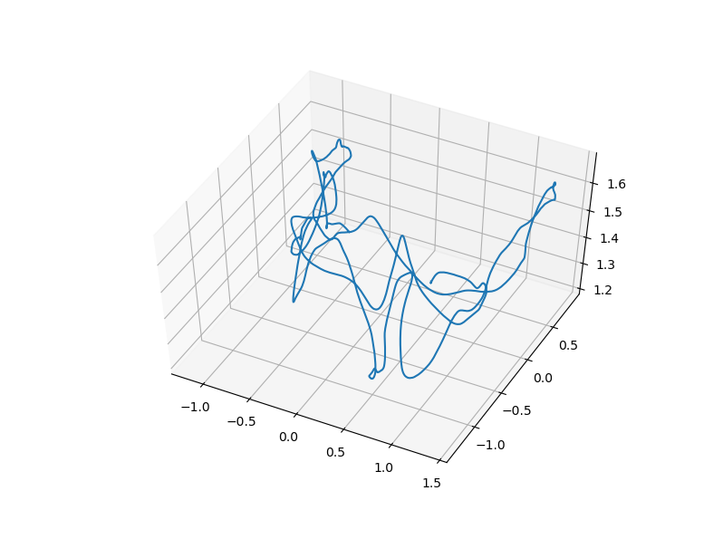

# Dataset Description

1. There is no direct one-to-one correspondence between rgb-depth images corresponding saved in rgb and depth folders downloaded (freiburg room1) from [TUM website](https://vision.in.tum.de/data/datasets/rgbd-dataset/download). 
2. Extract the dataset in datset folder cloned from repository.
3. Due to the difference in acquisition time, almost no two images are acquired at the same time. However, when we process images, we need to treat an RGB and a depth as a pair. 
4. Therefore, we need a step of preprocessing to find the one-to-one correspondence between rgb and depth images. TUM provides us with a tool to do this, please see [Toolbox](http://vision.in.tum.de/data/datasets/rgbd-dataset/tools).
5. Download the associate.py file to do rgb and depth matching.
6. python associate.py rgb.txt depth.txt > associate.txt . The output of the file is the aligned rgb and depth images which will be written to associate.txt

## About ground truth

1. The ground truth is the standard trajectory provided by the TUM dataset which is captured by MOCAP device.
2. Each data is: time, position (x, y, z), attitude quaternion (qx, qy, qz, qw).
3. Visualize groundtruth.
	python3 draw_groundtruth.py in dataset directory.
4. Finally the recording frequency of the external motion capture device is relatively high, so we need to associate ground truth with earlier associated rgb and depth images.
	python associate.py associate.txt groundtruth.txt > associate_with_groundtruth.txt

	 

## About TUM Cameras

*  In the data, the depth map has been adjusted to RGB according to the internal reference. Therefore, the internal parameters of the camera are mainly RGB.
* The scale of the depth camera is 5000 (which is different from kinect's default 1000). That is, the depth/middle image pixel value of 5000 is one meter in the real world. 

 
